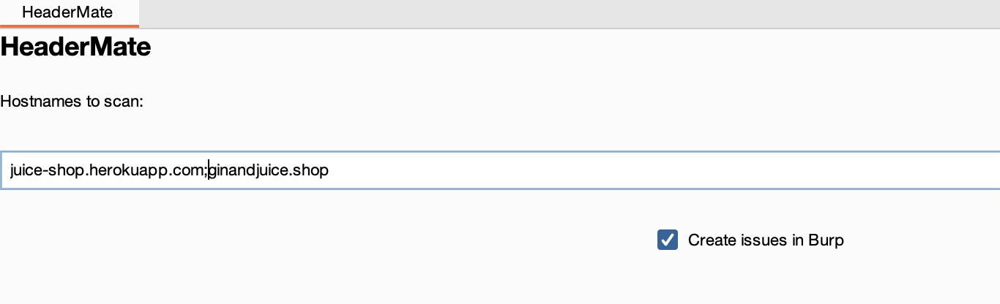
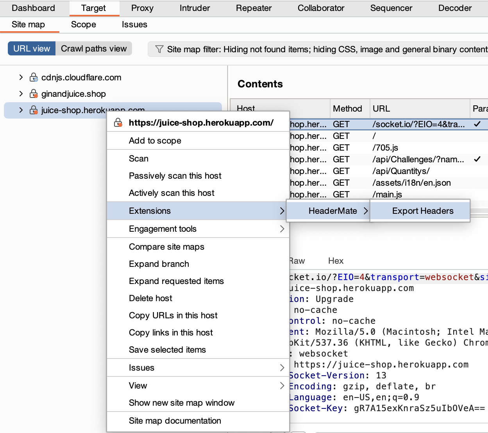
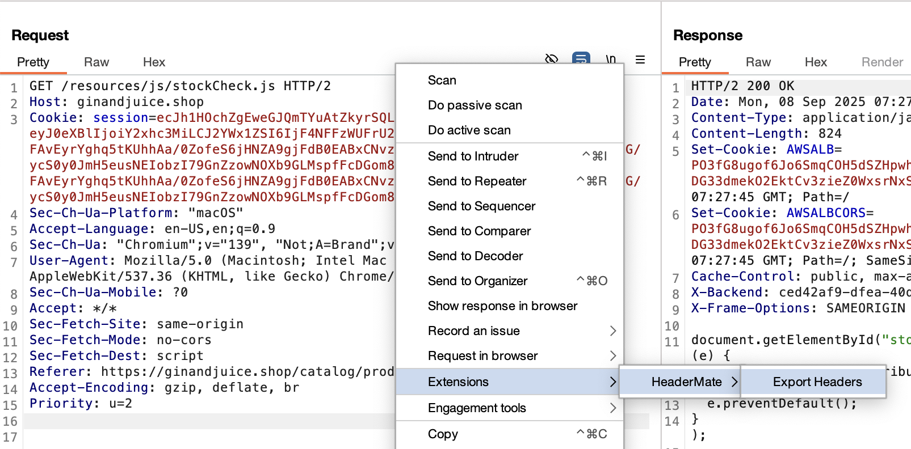

# HeaderMate

_HeaderMate_ is a Burp Suite extension written in Kotlin.
It helps security testers analyse server HTTP response headers and identify security improvements.
Part of its creation process is described in the
article [Burp Suite Extensions - Overview and Introduction to Development with Kotlin](https://www.scip.ch/en/?labs.20250911).

## Installation and usage

Download the JAR file from Releases or build it yourself as described later.

### Add the Extension to Burp Suite

Add `HeaderMate-x.x.x.all.jar` to Burp Suite by:

1. Open Burp Suite
2. Click the "Extensions" tab
3. Click "Add"
4. For "Extension Type", choose "Java"
5. Click the "Select File" button, and choose the `HeaderMate-x.x.x.all.jar`

### Configure the Extension

Open the HeaderMate tab in Burp Suite and add the desired hostnames, separating them with semicolons.
Select whether issues should be generated in Burp Suite and load your own configuration file if needed.


## Features

- Define which server HTTP response headers from which hosts should be analysed and logged in the current project's
  persistent storage
- Select whether the extension should generate issues in Burp Suite
- Export the logged server response headers
- Adjust the server header configuration with your own optimal values and severities for different values

## HeaderMate Configuration File

The configuration file can be adjusted as desired. Currently, however, only headers with clearly defined,
verifiable directive values are supported. The separator used in the configuration file is `#`.

Example configuration:

```
checklistID#header#optimalValue#passedValues#lowValues#mediumValues
37#X-Frame-Options#DENY#<none>#SAMEORIGIN|ALLOW-FROM#<empty>
```

_checklistID is an scip internal value._

### Export Logged Headers

The logged server HTTP response headers in the persistent storage can be exported via the context menu
`Extensions > HeaderMate > Export Headers`.
It does not matter where you export them, all logged headers will always be exported. You can find the context menu for
example in the Target tab or in a single request. The used separator in the exported CSV file is the ASCII unit
separator `0x1f`. The export is ideal for conversion to your preferred reporting tool.



## Open To-dos

- [ ] Implement all special cases
- [ ] Replace deprecated ScanCheck with PassiveScanCheck
- [ ] Move extension settings into Burp's settings dialog

-----

This extension is based on [KotlinBurpExtensionBase](https://github.com/ncoblentz/KotlinBurpExtensionBase) by Nick
Coblentz.
Therefore, here is an extract from his instructions for setting up IntelliJ and creating the JAR file. More detailed
instructions can be found in his GitHub repository.

## How to Build the Jar

### Install IntelliJ

Download and install IntelliJ IDEA: https://www.jetbrains.com/idea/

#### Within IntelliJ

Click the elephant symbol on the far-right hand bar and select `Tasks -> shadow -> shadowJar`

#### From the Command Line

When you want to produce a Burp Suite extension, you will need to build a JAR file that includes any external libraries
and
related Kotlin libraries. Build a plugin at the command line with:

- Linux: `gradlew shadowJar`
- Windows: `gradlew.bat shadowJar`


